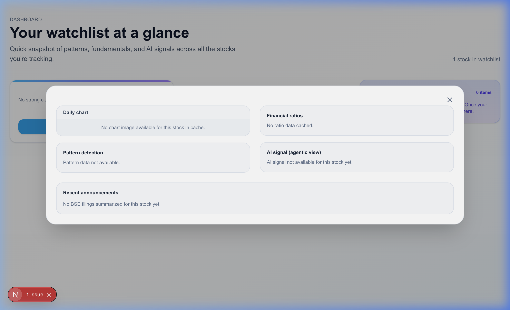

# 📈 AI-Powered Financial Result Tracker

**AI-Powered Financial Result Tracker** is a state-of-the-art financial analysis and results monitoring platform built for modern investors. The system blends deterministic financial modeling, automated data harvesting (Selenium, TradingView, BSE), and multi-modal generative AI agents to analyze chart patterns, compute financial health, read PDF exchange filings, and deliver institutional-grade research in a premium dashboard.

---

## 📸 Interactive System Demo

Check out the interactive stock wishlist, real-time charts, and AI-driven analyst signals in action:

| End-to-End Application Demo | Technical Analysis Modal |
| --- | --- |
|  |  |

---

## 🛠️ Key Features

*   **👁️ Multi-Modal Chart Vision Agent:** Automates TradingView browser rendering via Selenium, captures a chart screenshot, and passes it to Groq Vision models (`llama-4-maverick`) to analyze W-bottoms, flag breakouts, or triangles.
*   **🧠 Agno Agentic Analyst Core:** Uses structured Pydantic models and Agno AI to cross-reference fundamental ratios with live DuckDuckGo web results for bullish/bearish confidence scoring.
*   **📑 Exchange Filings Reader:** Harvester that fetches corporate filings from the Bombay Stock Exchange (BSE), downloads the raw PDFs, and processes them using a custom parser to produce bulleted summaries.
*   **📐 Financial Ratio Engine:** Computes advanced metrics (EBITDA margins, interest cover, Debt/Equity, ROE, ROCE) dynamically using live Yahoo Finance (`yfinance`) feeds.
*   **📦 Out-of-the-box Mock Firebase Fallback:** Local persistent database system that mocks Firestore and JWT Auth using local JSON serialization, allowing local execution without requiring complex Firebase cloud credentials.
*   **💻 Premium Glassmorphic Dashboard:** Built with Next.js 16, Tailwind CSS 4, Framer Motion, and Recharts for an elegant dark/light theme experience.

---

## 📐 System Architecture

```text
┌────────────────┐          API Requests (Port 5001)          ┌─────────────────────┐
│  Next.js 16    │ ─────────────────────────────────────────> │    Flask Backend    │
│  Client App    │ <───────────────────────────────────────── │     (main.py)       │
└────────────────┘          JSON Payload Responses            └──────────┬──────────┘
        │                                                                │
        ▼                                                                ▼
┌────────────────┐                                            ┌─────────────────────┐
│ Zustand State  │                                            │  Mock Firebase /    │
│ Management     │                                            │  Firestore JSON db  │
└────────────────┘                                            └──────────┬──────────┘
                                                                         │
                                       ┌─────────────────────────────────┴─────────────────────────────────┐
                                       ▼                                 ▼                                 ▼
                            ┌─────────────────────┐           ┌─────────────────────┐           ┌─────────────────────┐
                            │   Agno AI Agent     │           │ Groq Vision Canvas  │           │   BSE News PDF      │
                            │   (Financial Ratios │           │ (TradingView Chrome │           │   Filings Crawler   │
                            │   + DDG Web Search) │           │ Selenium Engine)    │           │   (PyPDF2 Parser)   │
                            └─────────────────────┘           └─────────────────────┘           └─────────────────────┘
```

---

## 📂 Project Structure

```text
├── backend/
│   ├── main.py                    # Flask API server, auth decorator, and wishlist cache routes
│   ├── mock_firestore.json        # Persistent local JSON store representing Firestore tables
│   ├── functions/
│   │   ├── chart_maker.py         # Selenium headless TradingView screenshot capturer
│   │   ├── chart_prediction.py    # Groq Vision parser + Agno post-processing normalization
│   │   ├── stock_signal_agent.py  # Agno AI Fundamental & Sentiment Analyst agent
│   │   ├── bse_news.py            # BSE filing fetcher, downloader, and PyPDF2 text summarizer
│   │   └── financial_ratios.py    # Deterministic Yahoo Finance metrics computer
│   └── .env                       # Backend API keys and model configurations
└── client/
    ├── app/                       # Next.js App Router (login, signup, overview, watchlist)
    ├── store/                     # Zustand central store for auth and workspace caching
    ├── public/                    # Static master stock asset JSON profiles
    └── package.json               # Frontend dependencies & Next scripts
```

---

## 🔌 Inside the Software: Core Snippets

The following code blocks illustrate the fundamental technologies that power the **AI-Powered Financial Result Tracker**:

### 1. Multi-Modal Vision & Agentic Chart Normalization
Found in `backend/functions/chart_prediction.py`, this demonstrates how a multi-step workflow captures a TradingView screenshot, feeds it to a Vision LLM, and then pipes it through an Agno Text Agent to ensure strict, typed validation of detected technical patterns:

```python
# functions/chart_prediction.py
from pydantic import BaseModel, Field
from agno.agent import Agent
from agno.models.groq import Groq as AgnoGroq
from groq import Groq

class ChartPatternSchema(BaseModel):
    pattern_found: bool = Field(description="Whether a clear, classical chart pattern is visible.")
    pattern_name: str = Field(description="Name of the main pattern, or 'None' if not found.")
    confidence: str = Field(description="Text label of confidence such as 'low', 'moderate', or 'high'.")
    explanation: str = Field(description="Short explanation of what was detected and why.")

# 1. Agno Agent used for normalizing and validating raw vision output
chart_pattern_agent = Agent(
    model=AgnoGroq(id="llama-3.3-70b-versatile"),
    description="Cleans and normalizes candlestick vision data into a strict schema.",
    output_schema=ChartPatternSchema,
)

def detect_chart_pattern(image_path: str):
    b64 = encode_image(image_path)
    client = Groq(api_key=API_KEY)
    
    # 2. Querying the multi-modal Vision model
    response = client.chat.completions.create(
        model="meta-llama/llama-4-maverick-17b-128e-instruct",
        messages=[
            {
                "role": "user",
                "content": [
                    {"type": "text", "text": "Analyze the candlestick chart and identify if a pattern is present."},
                    {"type": "image_url", "image_url": {"url": f"data:image/png;base64,{b64}"}}
                ]
            }
        ]
    )
    # 3. Feed unstructured output into the Agno agent for schema enforcement
    structured_result = chart_pattern_agent.run(response.choices[0].message.content)
    return structured_result.content
```

### 2. Structured Fundamental Analysis Agent
Found in `backend/functions/stock_signal_agent.py`, this defines a structured output Pydantic schema and configures the Agno agent to behave as a professional equities analyst:

```python
# functions/stock_signal_agent.py
from typing import Dict, List, Literal
from pydantic import BaseModel, Field
from agno.agent import Agent
from agno.models.groq import Groq

class StockSignalInput(BaseModel):
    ticker: str = Field(..., description="Yahoo-style ticker, e.g. RELIANCE.NS")
    ratios: Dict[str, float] = Field(default_factory=dict, description="Financial ratios calculated.")

class StockSignalOutput(BaseModel):
    ticker: str
    bias: Literal["bullish", "neutral", "bearish"]
    confidence: int = Field(ge=0, le=100)
    reasons: List[str] = Field(default_factory=list)
    risks: List[str] = Field(default_factory=list)
    latest_headlines: List[str] = Field(default_factory=list)

stock_signal_agent = Agent(
    model=Groq(id="llama-3.3-70b-versatile"),
    input_schema=StockSignalInput,
    output_schema=StockSignalOutput,
    tools=[DuckDuckGoTools()],
    description="Analyze pre-computed financial ratios and live news to generate sentiment signals.",
)
```

### 3. Transparent Mock Firebase Database Engine
Found in `backend/main.py`, this persistent local database client simulates Firestore and Firebase Auth if cloud coordinates are unavailable, ensuring zero manual cloud configuration:

```python
# backend/main.py
class MockDocumentReference:
    def __init__(self, doc_id, data=None, parent_collection=None):
        self.id = doc_id
        self._data = data or {}
        self.parent = parent_collection

    def set(self, data, merge=False):
        if merge:
            for k, v in data.items():
                if isinstance(v, MockArrayUnion):
                    current = self._data.setdefault(k, [])
                    for item in v.values:
                        if item not in current: current.append(item)
                else:
                    self._data[k] = v
        else:
            self._data = dict(data)
        
        # Auto-serialize back to file on write
        if self.parent and self.parent.db:
            self.parent.db.save_to_file()
```

---

## ⚙️ Setup & Operational Instructions

### 1. Pre-requisites & Port Bypass
> [!NOTE]
> This project has been updated to use port **`5001`** for the Flask API to avoid conflicting with macOS's native `ControlCenter` (AirPlay Receiver) which blocks port `5000`.

### 2. Backend Installation & Launch
1. Navigate to `backend/`
2. Install standard dependencies and vision tools:
```bash
./venv/bin/pip install flask flask-cors firebase-admin python-dotenv requests yfinance agno groq pydantic selenium webdriver-manager PyPDF2 ddgs
```
3. Set up your `.env` variables:
```env
GROQ_API_KEY=your_groq_api_key
WEB_API_KEY=optional_firebase_web_api_key
FIREBASE_CREDENTIALS=optional_path_to_firebase_json
```
*(If no Firebase keys are supplied, the mock fallback launches automatically and persists to `mock_firestore.json`)*
4. Run the Python application:
```bash
./venv/bin/python main.py
```

### 3. Frontend Installation & Launch
1. Navigate to `client/`
2. Perform standard npm installation (make sure to clear cache if disk space is low):
```bash
npm cache clean --force
npm install
```
3. Boot up the NextJS Turbopack development dashboard:
```bash
npm run dev
```
4. Access the web interface at **`http://localhost:3000`**

---

## 📡 Core API Reference Guide

The backend exposes the following local REST interface on `http://localhost:5001`:

| Route | Method | Headers | Description |
| --- | --- | --- | --- |
| `/user/signup` | POST | None | Creates a new database record (emulated in local JSON or real Firestore). |
| `/user/login` | POST | None | Validates credentials, issues mock/real JWT tokens, and fetches the profile. |
| `/me/wishlist/add` | POST | `Authorization: Bearer <JWT>` | Appends stock ticker to wishlist, launching selenium and agent pipelines. |
| `/me/wishlist/remove`| POST | `Authorization: Bearer <JWT>` | Removes a stock from the wishlist. |
| `/me/cache` | GET | `Authorization: Bearer <JWT>` | Pulls all pre-computed ratios, news, signals, and charts for the dashboard. |
